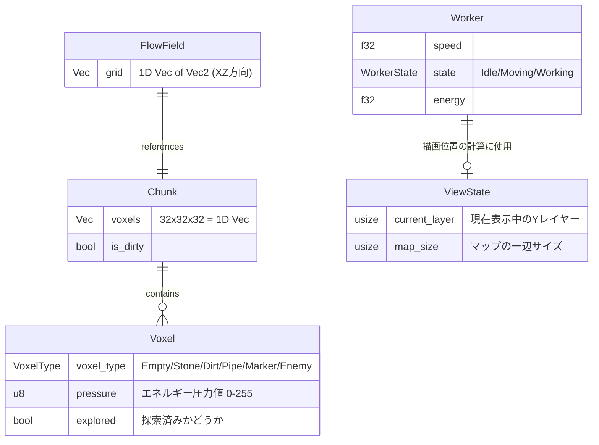
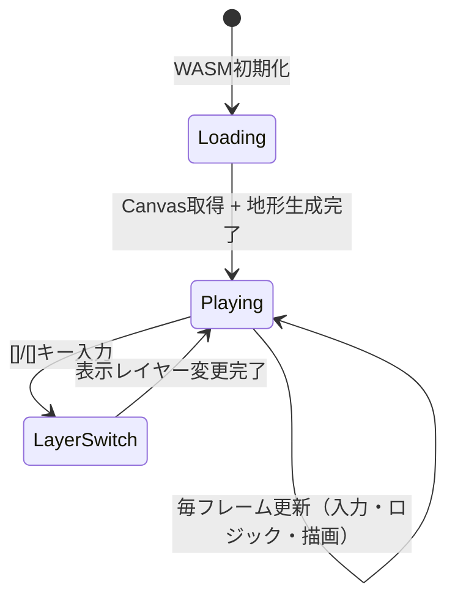

# 1. データモデル設計

## コアデータ構造



## VoxelType 定義
```rust
pub enum VoxelType {
    Empty,      // 空洞・通路
    Stone,      // 岩盤（掘削可能）
    Dirt,       // 土（掘削可能・軟弱）
    Pipe,       // エネルギーパイプ
    Marker,     // 掘削/建設指示マーカー
    Enemy,      // 敵（仮配置。将来はエンティティへ移行）
}
```

# 2. イベント/メッセージ仕様

Bevy Observer パターンを使用します。

| イベント | 発火タイミング | 受信側 |
|---|---|---|
| `VoxelClickedEvent { x, y, z }` | プレイヤーがCanvasをクリック | ボクセル変更システム |
| `MarkerPlacedEvent { position: Vec3 }` | 掘削マーカー配置 | フローフィールド再計算システム |
| `SpawnWorkerEvent { position: Vec3 }` | マーカー配置後 | ワーカースポーンシステム |
| `LayerChangedEvent { new_layer: usize }` | レイヤー切替 | 2Dレンダラー |

# 3. 主要コンポーネント設計

## 3.1 Canvas2Dレンダラー（`src/renderer.rs`）

```rust
/// 毎フレーム呼ばれる2D描画システム
/// BeyvのRenderパイプラインを使わず、web_sysのCanvas2D APIを直接操作する
pub fn render_system(
    view_state: Res<ViewState>,
    chunk_query: Query<&Chunk>,
    worker_query: Query<&Transform, With<Worker>>,
    canvas: Res<CanvasResource>,
)
```

- `CanvasResource`: `web_sys::CanvasRenderingContext2d` を `NonSend` リソースとして保持する。
- タイルサイズは `TILE_PX: u32 = 16` ピクセル。
- 現在の `view_state.current_layer` 番目のY層のみを描画する。

## 3.2 入力システム（`src/input.rs`）

- **マウスクリック**: Canvasの `onclick` イベントをwasm-bindgenでフック → クリック座標をタイル座標に変換 → `VoxelClickedEvent` を発火。
- **キーボード**: `[` / `]` キーでレイヤー切替 → `LayerChangedEvent` を発火。

## 3.3 ゲームアプリのメインループ

```rust
// Bevyのデスクトップウィンドウを使わず、wasm-bindgenのrAFループで管理する
pub fn start_game() {
    let mut app = App::new();
    app.add_plugins(MinimalPlugins.set(ScheduleRunnerPlugin::run_loop(
        Duration::from_secs_f64(1.0 / 60.0), // 60fps
    )));
    // ... システム登録
    app.run();
}
```

## 3.4 ボクセル管理（`src/voxel.rs`）
- `Chunk` は1次元 `Vec<VoxelType>` でヒープ確保（スタックオーバーフロー対策）。
- `get_idx(x, y, z)` で線形インデックス変換。

## 3.5 フローフィールド（`src/flow_field.rs`）
- 2D方向ベクトル `Vec2` のみを保持（Z軸は現レイヤー固定）。
- BFS による幅優先探索でフローフィールドを構築。

# 4. 状態遷移



# 5. ファイル構成

```
src/
  lib.rs          # wasm-bindgenエントリポイント（start_game関数をexport）
  main.rs         # 削除 or スタブのみ
  voxel.rs        # VoxelType / Chunk 定義
  flow_field.rs   # FlowField + BFSロジック
  swarm.rs        # Worker コンポーネント + 移動システム
  renderer.rs     # Canvas2D 描画システム（NEW）
  input.rs        # マウス/キーボード入力処理（NEW）
  game.rs         # App構築・システム登録（NEW）
```

# 6. エラーハンドリング方針
- WASM初期化時のCanvasDOM取得失敗は `panic!` で即座にブラウザコンソールへ出力（`console_error_panic_hook`）。
- ボクセルの範囲外アクセスは `VoxelType::Empty` を返却（パニックしない）。
- Bevy の `warn!` / `error!` マクロでブラウザコンソールへログ出力。
