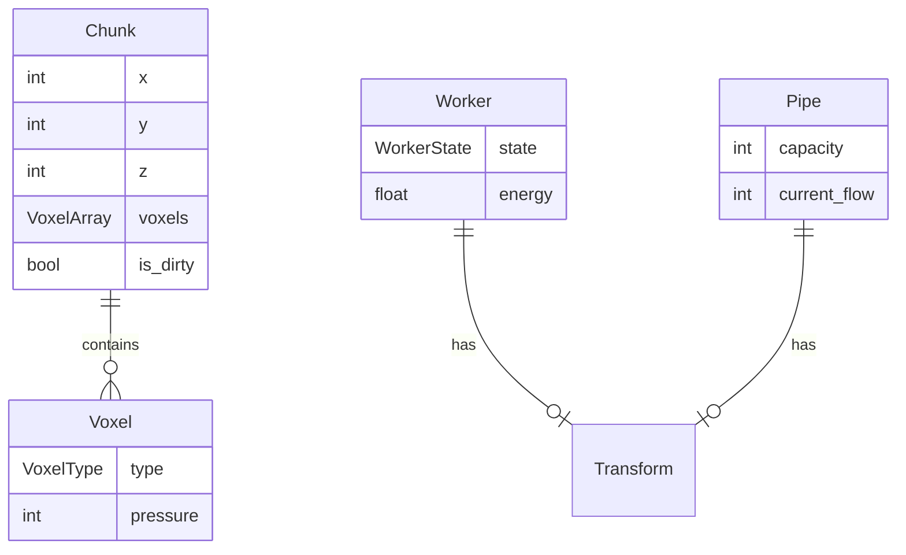
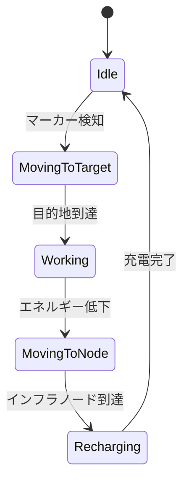

# 1. データモデル設計
ゲーム内のコアデータはBevyのComponentとして定義されます。

# 2. APIエンドポイント仕様
本作はスタンドアロンゲームであるため、Web APIは存在しません。代わりに、システム間のメッセージング（BevyのEvents）をAPI仕様とみなします。
- `Event<VoxelChangedEvent>`: ボクセルの破壊・設置時に発火し、メッシュ再生成とフローフィールド更新をトリガーする。
- `Event<SpawnWorkerEvent>`: プレイヤーが空間上にマーカーを置いた際に発火し、ワーカーエンティティを生成する。

# 3. 主要コンポーネント設計
- **Voxel/Chunk System**: `Chunk` コンポーネントは 32x32x32 の固定サイズのボクセル配列を保持します。メッシュ生成システムは `is_dirty` フラグを監視し、変更があった場合のみ再生成処理（メッシング）を行います。
- **Cellular Automaton System**: 毎フレーム（または固定Tick単位で）、`Pipe` コンポーネントを持つボクセルの `pressure`（背圧）を近接ボクセルへ伝播します。重力をシミュレートするため、下方向への伝播係数を高く設定します。
- **Flow Field System**: 目的地（マーカー等）からDijkstraアルゴリズムを用いて各ボクセル空間の距離（コスト）を計算し、ワーカーが向かうべきベクトルをキャッシュします。これにより数千のワーカーの個別の経路探索コストを削減します。

# 4. 状態遷移と主要シーケンス

以下は自律型ワーカー（スウォーム）の行動状態遷移です。

# 5. エラーハンドリング方針
- チャンク境界外へのボクセルアクセス（範囲外参照）試行時は、Panicを避け安全に `VoxelType::Empty` を返却する方針とします。
- メモリ不足やエンティティ生成失敗などの予期せぬエラー時には、例外を握りつぶさず、Bevyの `error!` マクロを用いてコンソールにエラーログを出力し、安全にステートをフォールバックします。
