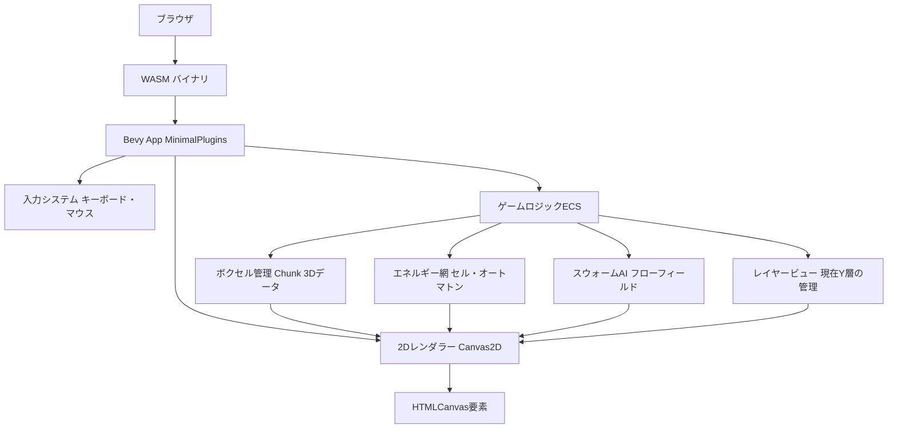

# 1. アーキテクチャ概要

本作はゲーム内部データ空間を3Dボクセルグリッドで保持しつつ、**プレイヤーへの描画は2D断面図ビュー**として提供するシミュレーションゲームです。

Bevy 3Dレンダラー（PBR・3Dカメラ）は一切使用せず、**Canvas 2D APIを wasm-bindgen 経由で直接呼び出す**シンプルなレンダリング層を採用します。これにより WASM バンドルサイズを大幅に削減し、ブラウザでの快速な起動を実現します。

ゲームロジック（ECS）は Bevy を継続利用しますが、`DefaultPlugins` の代わりに `MinimalPlugins` + 必要最低限のプラグインのみを使用します。

# 2. 技術スタック

| 項目 | 採用技術 | 理由 |
|---|---|---|
| 言語 | Rust | 高速・メモリ安全・WASMとの親和性 |
| ターゲット | `wasm32-unknown-unknown` 専用 | ブラウザ実行のみ |
| ゲームロジック | Bevy ECS（MinimalPlugins） | データ指向設計でロジックを整理 |
| レンダリング | `web-sys` Canvas2D API | 軽量、3Dレンダラー不要 |
| JS連携 | `wasm-bindgen` / `wasm-pack` | RustからWebAPIへのブリッジ |
| 地形生成 | `noise` クレート | Perlinノイズによる地形自動生成 |
| ビルド | `wasm-pack` または `wasm-server-runner` | WASM最適化ビルドとサーバー起動 |
| 物理演算 | カスタム実装（セル・オートマトン / フローフィールド） | 汎用物理エンジン不使用 |

# 3. システムコンポーネント図

# 4. レンダリング設計（2Dスライスビュー）

## 描画方式
- Bevy の `DefaultPlugins` は使用しない。代わりに `MinimalPlugins` + `ScheduleRunnerPlugin` を使用してゲームループを管理する。
- 描画はBevyのRenderパイプラインを経由せず、毎フレーム `web_sys::CanvasRenderingContext2d` を直接呼び出してタイルを描画する。
- `window.request_animation_frame` ループを wasm-bindgen で実装し、Bevy の `App::update()` を毎フレーム呼び出す。

## 描画内容（1タイル = 1ボクセル）
| ボクセル種別 | 色 |
|---|---|
| Empty（空洞） | 黒 `#111` |
| Stone（岩盤） | グレー `#666` |
| Dirt（土） | 茶色 `#8B4513` |
| Pipe（パイプ） | シアン `#00FFFF`（圧力値で輝度変化） |
| Worker（ワーカー） | オレンジ `#FF8C00` |
| Enemy（敵） | 赤 `#FF2222` |
| Fog（未探索） | 濃い紺 `#1a1a2e` |
| Marker（掘削指示） | 黄 `#FFFF00` |

## レイヤー管理
- 現在表示中のYレイヤーを `ViewState` リソースで管理する。
- キーボード `[` / `]` または画面上のボタンでレイヤーを切替える。

# 5. インフラストラクチャ設計

- **実行環境**: Webブラウザ専用（WASM）
- **ビルドコマンド**: `cargo run --target wasm32-unknown-unknown`（wasm-server-runner 経由）
- **将来的なCI**: GitHub Actions で `cargo test`（ユニットテスト）+ `wasm-pack build` を実行し、GitHub Pages へ自動デプロイ。
